# Kod Akışı

Claude Code çalışırken yazdığı kodu yan panelde canlı gösteren eklenti. · [English](README.en.md)



<sub>Önizleme temsilidir; panel Claude Code'un kendi yazı tipi ve renk temasıyla çizilir.</sub>

Claude bir dosya yazarken ekranda çoğu zaman bir bekleme animasyonu ve tıklayınca açılan satırlar olur. Kod Akışı, modelin ürettiği kodu üretildiği anda konuşmanın yanındaki panelde akıtır. Dosyalar satır numarasıyla ve renkli gelir, düzenlemeler eksi/artı fark olarak görünür, komutlar çıktılarıyla birlikte durur. Düşünce metni gönderiliyorsa o da kendi kutusunda akar; alt ajanlar çalışıyorsa her biri kendi şeridinde izlenir.

Modelden ek bir şey istemez, zaten gelen yanıt akışını çizer. Bu yüzden fazladan token harcamaz.

## Kurulum

Güncel bir Claude Code yeterli (2.1.286 sürümüyle denendi). Aşağıdaki iki yoldan birini seç, sonra Claude'u yeniden başlat ya da yeni bir oturum aç.

### Tek komutla

macOS ve Linux (Terminal):

```bash
git clone https://github.com/Ilyas-jpg/kod-akisi ~/.claude/skills/kod-akisi
```

Windows (PowerShell):

```powershell
git clone https://github.com/Ilyas-jpg/kod-akisi "$HOME\.claude\skills\kod-akisi"
```

Bilgisayarında git yoksa (macOS ve Linux):

```bash
mkdir -p ~/.claude/skills/kod-akisi && curl -fsSL https://github.com/Ilyas-jpg/kod-akisi/archive/refs/heads/main.tar.gz | tar -xz --strip-components=1 -C ~/.claude/skills/kod-akisi
```

### Eklenti yöneticisiyle

`claude` komutu kuruluysa:

```bash
claude plugin marketplace add https://github.com/Ilyas-jpg/kod-akisi
claude plugin install kod-akisi@ilyassaltay
```

Claude Code terminalinin içinden aynısı: `/plugin marketplace add https://github.com/Ilyas-jpg/kod-akisi`, ardından `/plugin install kod-akisi@ilyassaltay`.

İki yoldan yalnız birini kullan. İkisi birden kuruluysa Claude Code aynı adlı eklentinin ilkini yükler.

## Kullanım

Kurulumdan sonra açtığın oturumda panel kendiliğinden gelir. Claude bir dosya yazmaya, düzenlemeye ya da komut çalıştırmaya başladığında kod panelde akar.

| Komut | Ne yapar |
|---|---|
| `/kod-akisi` | Paneli açar. |
| `/kod-akisi kapat` | Paneli kapatır ve sonraki oturumlarda kendiliğinden açılmasını durdurur. `/kod-akisi` yazınca geri gelir. |

Terminaldeki Claude Code'da panel geniş pencerede kendiliğinden, dar pencerede `/kod-akisi` yazınca açılır.

## Panelde ne var

- **Sahne.** Yazılan dosya satır numarasıyla ve sözdizimi renkleriyle akar, son satırlar izlenir, uçta imleç durur. Düzenlemeler canlı fark olarak gelir; araç bitince gerçek satır numaralı yamaya döner. Komutlar altlarında çıktılarının son satırlarıyla görünür.
- **Başlık.** Claude'un o an ne yaptığı (düşünüyor, yazıyor, çalıştırıyor, anlatıyor), çalışan alt ajan sayısı, araç sayısı, üretilen token ve süre. Altında akış hızının grafiği: çubuklar sağda doğar, sola yürürken solar.
- **Düşünce.** Modelin düşünce metni mor çerçeveli kutuda akar, son satırlar izlenir. Araç çalışırken son düşünce soluk hâlde okunur kalır.
- **Ajanlar.** Çalışan her alt ajan için bir satır: türü, o an yaptığı iş, araç sayısı ve süresi.
- **Akış satırı.** Anlatım metninin canlı ucu.
- **Günlük.** Son araç çağrıları, en yenisi üstte. Alt ajanın çağrıları ajanın rengiyle işaretlenir.

Yalnız `Write` ve `Edit` değil; SQL sorgusu, HTML, uzun bir istem gibi çok satırlı her araç argümanı sahneye çıkar.

## Düşünceyi görmek

Claude Code, düşünce metnini yalnız istenirse gönderir. İstenmediğinde model yine düşünür ama metni akışta yer almaz; panel de çizecek bir şey bulamaz.

- **Masaüstü uygulaması:** konuşmanın başlık menüsünden Transcript view › Thinking (ya da Verbose) seç. Yeni oturumların varsayılan görünümü Ayarlar'dan değişir.
- **Terminal:** `~/.claude/settings.json` içine `"showThinkingSummaries": true` ekle.

Gelen metin modelin ham iç konuşması değil, Claude Code'un sunduğu düşünce özetidir. Düşünce gizli akıyorsa panel ilk birkaç turda bunu nasıl açacağını söyleyen soluk bir not gösterir, sonra susar.

## Alt ajanlar

Claude işi alt ajanlara dağıttığında her ajan panelde kendi satırını alır. Sahne, o an kod yazan döngüyü gösterir ve başlığına ajanın adını yazar. Ana konuşma her zaman önceliklidir; paralel ajanlar birbirinin akışını yarıda kesmez, sahne bir akış durulunca öbürüne geçer.

Ana konuşma bitse de arka planda çalışan ajan izlenmeye devam eder; başlık kaç ajanın çalıştığını söyler. Terminalde görev listesinden bir ajanın konuşmasını açtığında panel yalnız o ajanı çizer.

Motorun kendi iç döngüleri (konuşmayı sıkıştırma, hafıza gibi) ajan sayılmaz ve panele karışmaz.

## Güncelleme ve kaldırma

Tek komutla kurduysan:

```bash
git -C ~/.claude/skills/kod-akisi pull
```

Kaldırmak için `~/.claude/skills/kod-akisi` klasörünü silmen yeterli.

Eklenti yöneticisiyle kurduysan:

```bash
claude plugin update kod-akisi@ilyassaltay
claude plugin uninstall kod-akisi@ilyassaltay
```

## Nasıl çalışır

Kod Akışı, Claude Code'un mod sistemi (function hooks) üzerinde çalışır. Modelin yanıt akışını `turn.step` olayında dinler, araç argümanlarının JSON'unu parça parça çözer ve paneli çizer. Akışı ve araç sonuçlarını değiştirmez, her parçayı geldiği gibi geçirir.

Ağa çıkmaz, dosya okumaz ya da yazmaz, süreç başlatmaz. Motordan istediği şeylerin tamamı şunlardır: panel açma ve kapama, kendi durumunu ve iki küçük tercihi saklama, zamanlayıcı, komut kaydı, bildirim, alt ajan listesini okuma ve hata ayıklama günlüğüne tek satır. `claude plugin validate .claude-plugin/plugin.json` bu dökümü kaynaktan okuyup gösterir.

## Sınırlar

- Mod sistemi erken erişimde; bir Claude Code güncellemesiyle değişebilir. Böyle bir durumda panel gelmez, oturumun kendisi etkilenmez.
- Arayüz Türkçe.
- Windows'taki masaüstü uygulamasında kullanılarak, terminal yüzeyinde ise Claude Code'un test takımıyla denendi. Kod işletim sistemine özgü bir şey kullanmıyor, bu yüzden macOS ve Linux'ta da çalışması beklenir; orada henüz denenmedi.

## Geliştirme

```bash
claude plugin validate .claude-plugin/plugin.json
claude plugin test .
```

İlk komut kancaları ve motor çağrılarını Claude Code'un gözünden okur. İkincisi sahte bir model akışıyla paneli masaüstü ve terminal yüzeyinde çizer; `tests/yerlesim.test.ts` panelin düz metin önizlemesini de basar.

Terminal bir hücre ızgarasıdır, masaüstü ise yazıyı orantılı yazı tipiyle çizer. Bu yüzden satırlar hem sütuna göre kırpılır hem esnek kutularla dizilir; hız grafiği terminalde blok karakterlerle, öbür yüzeylerde genişliğe esneyen vektörle çizilir.

Kaynak üç dosyadır: `hooks/register.tsx` (kancalar ve çizim), `hooks/akis.ts` (akan JSON okuyucu, kuyruk tamponu, fark üretimi), `types/index.d.ts` (panelin durum sözleşmesi).

## Lisans

[MIT](LICENSE). Yapan: İlyas Saltay · [ilyassaltay.com](https://ilyassaltay.com)

Claude Code ile birlikte geliştirildi; doğrulama ve testler depoda.
